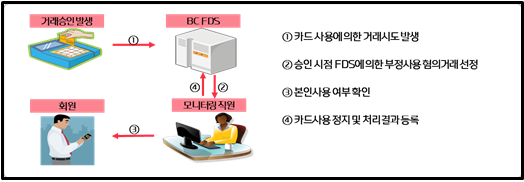

# 개요5. 실제 현업 적용 사례 - 금융
- 금융 Domain에서 이뤄지는 이상 탐지 실제 사례 스터디

 

## 1. 사용자 패턴 분석을 통한 금융 사기 탐지 (카카오뱅크)

- [출처: "비번 누르는 속도·리듬까지…스마트폰 습관으로 금융사기 잡는다"](https://www.hankyung.com/economy/article/202208091621i)

- 문제 정의
  - 비대면 금융 서비스의 발달로 편의성이 증가한 반면 사기에도 취약해짐
  - 분실 및 도난 핸드폰과 신분증을 가지고 타인 명의로 대출을 받는 금융 사기 증가
  
- 기대효과
  - 비대면 거래상 소비자 금융 피해 사전 방어

- 이상 데이터 정의
  - 개인의 스마트폰 활용 습관은 복제하기 어려움 >> 스마트폰 터치 시간, 압력, 속도 등이 기존 사용자와 다를 경우 타인으로 의심

- 문제해결 프로세스
  - **개인의 습관을 파악**할 수 있는 스마트폰 터치 압력, 속도, 리듬, 패턴 등 다양한 데이터 수집
  - 수집된 데이터로 사용자의 **연령대를 분류하는 모델** 개발 
    (비밀번호 3~4회 입력한 기록만 있으면 연령대 예측이 가능하다고 함)
  - 예측한 연령대가 사전에 제출한 신분증 이미지의 연령과 다를 경우, 타인으로 의심하여 추가 인증(영상통화 등)을 수행
  
- 성과
  - '무자각 행동 인증' 시스템 개발 >> 실험 테스트 결과 10명 중 8.9명 사기 감지
  - 금융 사기 예방, 소비자 자산 보호 강화에 기여

  
 
 ## 2. FDS, 은행 카드사 사기거래 탐지 (BC카드)
 
- [출처: FDS, 신용카드 부정사용 방지의 '첨병'](https://www.kbanker.co.kr/news/articleView.html?idxno=205035)

- 문제 정의
  - 다양한 사기 방법으로 발생하는 금융 사기, 소비자 피해 증가

- 기대효과
  - 금융 사기 사전 차단으로 소비자 피해 예방
  - 사고 빈발 사례에 대해서는 선제적으로 거래 차단

- 이상 데이터 정의
  - 평소 거래 패턴과 다른 패턴으로 발생한 금융 거래

- 문제해결 프로세스
    

    
    - FDS(Fraud Detection System)을 개발하여 부정거래를 탐지하고, 본인사용 여부 확인 및 카드사용 정지   
    - FDS는 **스코어링(Scoring)** 방식과 **룰(Rule)** 방식으로 나뉨   
      - 스코어링 방식
        - 카드 결제시 **부정사용 관련 각종 지표(domain 활용)**을 바탕으로 부정사용 혐의 정도를 점수화 -> 특정 점수를 넘으면 부정사용으로 탐지
        - 지표 개발/업데이트가 잦을 경우 시스템 개발 및 운영에 장시간 소요됨. 주로 정형화된 부정사용 적발시 효과적
      - 룰 방식
        - 부정사용 혐의 거래에 대한 **명확한 조건을 사전에 추출**한 뒤, 카드결제 **전수를 모니터링** -> 조건에 의해 탐지된 거래는 사전 차단
        - 단기간 내 규칙을 생성할 수 있음. 복잡하고 특수한 조건, 새로운 유형의 부정거래에 신속하게 대응 가능
        - 그러나 룰이 너무 많아지면 서로 충돌이 발생할 수도 있고, 정상 거래 분류가 너무 빡빡해질 수 있음 
  - 실제로는 스코어링과 룰 방식을 적절히 혼합해 사용함

- 성과
  - BC카드 2020년 약 44억원, 21년 약 96억원 상당의 금융사기 예방
  
