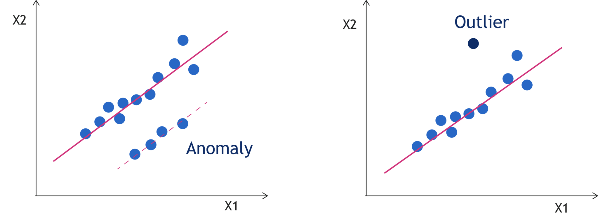

# 개요1. 이상탐지의 정의와 발생원인

## 이상의 정의
- 이상치(outlier) vs 이상(abnormal)
    

    그림1. 이상값과 이상치의 차이

    ||이상치|이상|
    |:---|:---|:---|
    |정의|- 데이터 관점| - 현업에서의 문제 해결 관점   - **이상이라고 정의**한 사건 탐지   - 리스크 방지 목적: ex. 비정상 금융 거래 탐지를 통한 소비자 보호|
    |특징|- 관측 범위에서 벗어난 값, 드물게 발생   - 분석 결과 해석에 오해 방지를 위해 사전 제거 (유리: 이상치를 반드시 제거하는 것은 아님)     |- 문제 해결의 관점   - 현업 관점에서 문제 발생 가능성 높은 값   - 정상적 범주여도 이상일 수 있음   - 일반적으로 드물게 발생하는 사건|
    

## 이상 발생의 원인
- 자연적인 이상 사건뿐 아니라 데이터 수집 및 분석 단계에서 이상 발생 가능
1. 데이터 추출 오류
    - 다른 모수에서 샘플 추출하는 등 샘플링 오류
    - 예시 상황: 데이터 일부를 추출해 분석할 때 목적에 맞지 않게 추출, ex. 1분기 학습/테스트 셋을 추출해야 하는데 다른 시점 추출
    - 유리: 샘플링 에러 용어를 일컫는 말이 별도로 있으므로 표본추출 오류 용어를 데이터 추출 오류로 수정
2. 입력 오류
    - 데이터 입력, 수집 오류, 분포로 쉽게 탐지
    - 사람에 의한 오류, 수기로 입력할 때 종종 발생
3. 실험 오류
    - 실험 조건이 일정하지 않는 등 실험에서의 오류
    - 실험 조건 모니터링을 통해 실험 오류 방지
4. 측정 오류
    - 측정 장비의 입력 오류(2와의 차이점은 사람의 입력이 아닌 기계의 입력)
    - 다른 측정기와의 입력 분포 비교로 오류 탐지, ex. 0점 조정이 안된 체중계
5. 데이터 처리 오류
    - ETL 과정에서의 오류
6. 자연 오류
    - 데이터 분석에서의 이상탐지 대상

