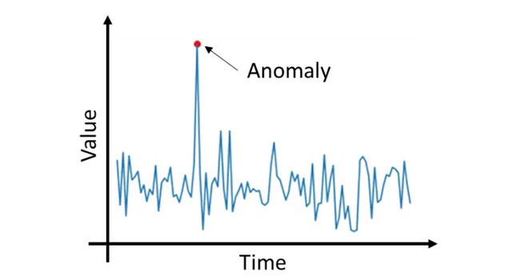
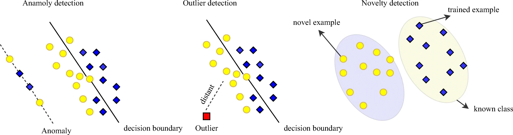

# 개요2. 이상탐지의 종류

- 데이터 종류, 해결 문제에 따라 다른 이상탐지 알고리즘 적용

> ## 데이터 종류

<figcaption align="center">그림1. 시계열 이상탐지</figcaption>

1. 시계열 데이터(sequence)
    - sequence vs static data
        - 데이터 간 순차적 연관성 있으면 sequence, 없으면 static
    - ex. 시간에 따른 휴대폰 온도
2. 단변량 vs 다변량
    - 반드시 다른 방법론을 적용할 필요는 없지만, 변량의 종류에 따라 알맞은 방법론 적용
3. 데이터 타입
    - 이진, 범주형, 연속형, 혼합형 등 데이터 타입에 따라 다른 방식의 이상탐지
4. 데이터 간 관계(relational vs independent)
    - 주로 피쳐 엔지니어링에서 데이터 간 관계 파악
    - 예컨대, 회귀분석에서 상관계수 높으면 다중공선성 문제로 처리 필요
5. Usecase 존재여부
    - 이미 알려진 문제의 이상탐지의 경우 usecase 벤치마킹
    - 알려지지 않은 문제의 경우 여러 방법론 적용, 어려운 문제

> ## 이상탐지의 종류
<table>
    <thead>
        <tr>
            <th>구분</th>
            <th>종류</th>
            <th>특징</th>
        </tr>
    </thead>
    <tbody>
        <tr>
            <td rowspan=2>정적</td>
            <td>1. Point Anomaly Detection</td>
            <td>- 일정 기간 내 수집된 데이터 내 분포로부터 이상 탐지   
            - 특정 포인트의 이상 감지  
            - 일반적으로 outlier</td>
        </tr>
        <tr>
            <td>2. Distriubted Anomaly Detection</td>
			<td> - 정상 분포로부터 벗어난 이상 데이터 감지</td>
        </tr>
        <tr>
            <td rowspan=2>동적</td>
            <td>3. Contextaul Anomaly Detection</td>
            <td>- 시계열(시퀀스)에서의 이상감지  
            - 연속적 맥락 내 동떨어진 패턴 감지   
            - global 이상
        </tr>
        <tr>
            <td>4. Collective Anomaly Detetcion</td>
			<td> - 다른 집합과의 비교를 통해 비유사성 감지   
            - local 이상</td>
        </tr>
        <tr>
            <td> 기타 </td>
            <td> 5. Online Anomaly Detetction </td>
            <td> - 실시간 데이터에서의 이상감지   - 빠른 처리가 관건이므로 과하게 복잡한 모델은 지양 </td>
        </tr>
    </tbody>
</table>

> ## Label vs Unlabel 이상탐지 비교

||1. Supervised|2. Semi Supervised | 3. Unsupervised|
|:---|:---|:---|:---|
|정의|- label이 있는 경우(정상, 이상 정답지 있음)에서의 이상 탐지   - 즉, 이상상태 정의 가능|- 정상 데이터만 보유한 경우에서의 이상탐지| - 정상, 이상 라벨 모두 없음
|작동방식|- 주로 binary 분류로 해결, 가끔 multi-class 분류로 해결| - 정상 데이터 분포 학습 후 정상 데이터로부터 동떨어진 데이터가 들어오면 이상으로 판단    - 정상 데이터의 discriminative boundary(구분선) 설정, 이 margin을 최대한 좁힌 후 구분선 밖을 이상으로 간주|- 자기 자신의 패턴 학습&예측  - 자기자신 예측의 잔차가 threshold 넘으면 이상으로 간주|
|알고리즘|랜덤포레스트 등 트리 계열알고리즘 등|one class svm|AutoEncoder 또는 딥러닝 알고리즘|
|장점|- 다양한 알고리즘 쉽게 적용 가능|- 정상 데이터만 있어도 학습 가능, 연구 활발|라벨링 과정 없음|
|단점|- 대개 이상상태는 희소하기 때문에 소수 클래스 문제(클래스 불균형 문제)에 봉착|- Supervised 이상탐지에 비해 양/불 정확도 떨어짐|- 양/불 정확도 낮음, 하이퍼파라미터에 민감|
|기타|- 성능평가 Accuracy 보다는 Recall(실제 이상치 중 맞춘 비율)로 평가|- 이상 label이 극도로 적으면 semi-supervised 이상탐지를 적용하는 것이 효율적일 수도 있음|- 정상 구간 정의 어려움, 정상이라고 "추정" $\rightarrow$ 추정 행위는 항상 주의해야 함|

> ## 학습 데이터에 따른 이상탐지 비교

  
  <figcaption align="center">그림2. (1)이상 탐지 (2) 이상치 탐지 (3) 새로움 탐지</figcaption>

- 문제 정의에 따라 해결방식이 달라짐!

||1. Anomaly Detetction|2. Outlier Detection | 3. Novelty Detetction|
|:---|:---|:---|:---|
|정의|- 현업의 룰에 의해 이상 정의 후 탐지|- 대부분의 샘플과 분포가 동떨어진 데이터 탐지|- 새로운 패턴 데이터를 찾기   - 리스크와 관련 없을수도 있음
|훈련셋||훈련 데이터 내 정상, 이상치 샘플 모두 있음|-이상치 없음  - **학습 데이터가 이상치에 의해 오염되지 않았다고 가정**   - 훈련셋 내 모든 샘플과 다른 새로운 샘플 탐지가 목적(훈련셋 내 모든 샘플은 outlier가 아닌 것으로 간주)|
|작동방식||- 중앙(데이터 중심부 피팅)에서 벗어난 데이터를 이상치로 판단|- "Out of Distribution": 모르는 분포에서 발생한 문제 탐지   - In-Distribution(보유한 학습셋)으로 multi-class 예측 & out-of-distribution 걸러냄|
|예시|||- 개 종 분류 문제에 고양이 데이터 테스트|

