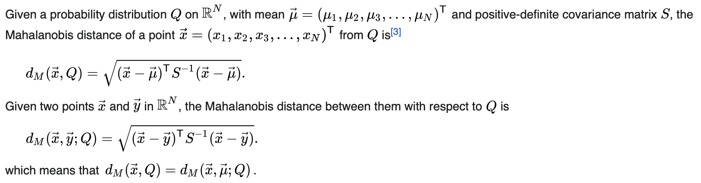
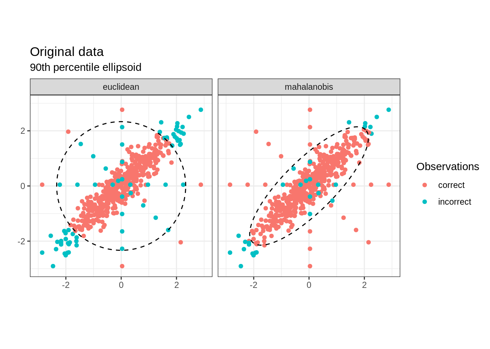

# 거리기반 이상탐지 - 마할라노비스 거리

> ## 정의
1. 수식적 의미
    ([참조. 위키피디아](https://en.wikipedia.org/wiki/Mahalanobis_distance))
    <center></center>
    <center>그림1. 마할라노비스 거리의 수식 정의</center>

    - $N$차원 벡터의 데이터로 이루어진 분포 $Q$가 있을 때 각 차원서의 평균 값들의 모음인 평균 벡터를 $\mu$라 하자. 이 때 분포 $Q$로부터 특정점 $x$의 마할라노비스 거리는 위 수식 $d_M(x,Q)$와 같다.
    - 마할라노비스 거리(MD)의 정의를 보면 평균 값($\mu$)을 빼고 공분산($S$)으로 나눈다. 즉, 원점조정과 스케일 조정 변환(정규화) 후 대부분의 데이터($Q$)와 새로운 점 $x$ 간 거리 차이를 계산한다. 해석하자면, 대부분의 데이터가 밀집된 중심점으로부터 얼마나 희소한 공간에 새로운 데이터가 위치한 지를 측정하는 것이다.
2. 해석적 의미
    <center></center>
    <center>그림2. 유클리디안 거리 vs 마할라노비스 거리</center>

    - 중심점까지의 거리를 기준으로 이상치 식별
    - 유클리드 거리 개념에 공분산 계산이 더해진 개념(변수 간 상관관계 고려)
    - 점과 분포 사이의 거리 측정
    - 다변량에서 효과적으로 작동
        - 참고. 3sigma & 박스플랏: 명확하고 재계산 필요 없으나 다변량 이상탐지에서 취약
    - 유클리드 거리와는 달리 분포 패턴 기반 이상치 탐지

> ## 장점 & 단점
|장점|단점|
|:---|:---|
|- 데이터의 분포 고려한 이상탐지 가능 <br/> - 비선형 관계 데이터에 적용 가능 <br/> - **데이터 가정 필요 없음**<br/> &nbsp;&nbsp; (참고. 3sigma & 박스플랏은 정규성 가정 필요) | - 변수 간 관계가 모두 독립이면 유클리드와 상동 <br/> - 변수 간 상관성이 명확하지 않은 경우 적용 어려움|

> ## 사용방법
- 일반적으로 이상치 탐지는 일정한 분포(가우시안 분포)로부터 정상적인 데이터 추정
- 공분산 추정, 중심 데이터들을 타원형에 적합
- Threshold 넘으면 이상치로 간주

> ## 적용사례
- 일정한 스펙의 제품 생산 시 이상 제품탐지
- ex. 2차전지 

> ## 예제 코드
```
import pandas as pd
import numpy as np

# ▶ 정규 분포를 이용하여 데이터 분포에 타원을 그림, 타원에서 벗어날수록 outlier
from sklearn.covariance import EllipticEnvelope
# ▶ 랜덤 데이터를 생성하는데 사용됩니다. (※ 모든 방향으로 같은 성질을 가지는 정규분포를 이용해 가상 데이터 생성 클러스링 용 가상데이터를 생성하는데 사용)
from sklearn.datasets import make_blobs

# ▶ 랜덤 데이터 생성
X, _ = make_blobs(n_samples = 100,
                  n_features = 2,
                  centers = 1,
                  random_state = 1)

# ▶ 이상치 Input
X[0,0] = 10
X[0,1] = -10

# ▶ EllipticEnvelope 을 이용하여 outlier를 검출하기 위한 객체를 생성합니다.
# ▶ The amount of contamination of the data set, i.e. the proportion of outliers in the data set
outlier_detector = EllipticEnvelope(contamination=.5)

# ▶ EllipticEnvelope 객체를 생성한 데이터 학습
outlier_detector.fit(X)

# ▶ outlier를 검출
# ▶ +1 이면 boundary 안에 들어온 값으로 정상 데이터
# ▶ -1 이면 outlier로 간주.
pred = outlier_detector.predict(X)
pred
```