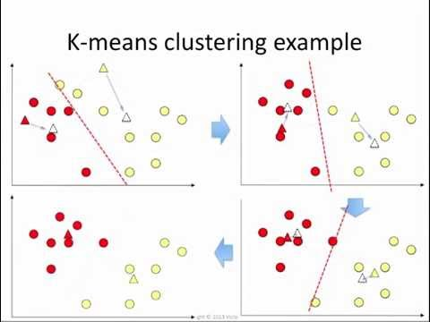

# 거리기반 이상탐지 - KNN

> ## 정의
- K-Nearest-Neighbors: K개의 이웃한 데이터 기반 **분류**
- 데이터로부터 거리가 가까운 K개의 다른 데이터의 레이블 참조하여 분류
    - 참조한 K개의 데이터의 레이블 중 가장 많은 레이블을 해당 데이터의 정답지로 할당
- 이상, 정상 label 존재할 때만 적용 가능

## 참고. KNN vs KMEANS
- 이름이 유사하지만 완전히 다른 알고리즘이다. 두 알고리즘을 구분하는 것은 단골 출제 문제다.

    ||<center>KNN</center>|<center>KMEANS</center>|
    |:---|:---|:---|
    |개념그림|    <center></center>|    <center></center>|
    |목적|<span style="color:red"> 분류(지도학습)</span>|군집화(비지도학습)|
    |K의미|K개의 주변 데이터 답지 참조|K개의 군집(그룹)으로 데이터를 나눔|
    |알고리즘 작동 방식|거리기반 할당(거리계산 1회만에 알고리즘 종료)|반복적인 군집 재배치(중심점이 변화하지 않을때까지 데이터 군집에 할당 & 중심 계산 반복)|

> ## 장단점

- 주로 운영 보다는 EDA, baseline 차원에서 사용

|장점|단점|
|:---|:---|
|1. 높은 정확도(기존 값 모두 검사해 비교하므로) <br/> 2. 단순, 효율적 $\rightarrow$ 현업에 설명 쉬움 <br/> 3. 수치기반 데이터 분류에서 잘 작동 ex. 객단가, 구매고객수, height 등 <br/> 4. 데이터에 대한 가정 필요 없음|1. 데이터 많을수록 처리시간 선형적 증가(기존 모든 데이터와 거리 계산)<br/>2. 특징과 클래스 간 관계 파악 어려움(정답지(이상) 판단의 이유 현업에 설명 어려움) <br/>3. 카테고리 컬럼 추가 처리 필요(거리 구하는 데 오해의 소지 있음 ex. 남자 1 여자 0 처리 등)|


> ## 코드
- [PyOD(Python Outlier Detection 파이썬 패키지)](https://pyod.readthedocs.io/en/latest/): 다양한 종류의 이상탐지 모듈 있음
    - [KNN 코드 튜토리얼](https://pyod.readthedocs.io/en/latest/pyod.models.html#pyod.models.knn.KNN)

    ```
    class pyod.models.knn.KNN(contamination=0.1, n_neighbors=5, method='largest', radius=1.0, algorithm='auto', leaf_size=30, metric='minkowski', p=2, metric_params=None, n_jobs=1, **kwargs)[source]
    ```

- 하이퍼파라미터 K: 보통 <span style="color:red"> 홀수개</span>로 지정, 짝수개로 지정하면 정답지 중복 발생 가능 ex. 3개 데이터 1번 label vs 3개 데이터 3번 label
- 표준화 필요: min-max normalization, z-score standardization
- 새로운 데이터가 들어오면 모든 데이터와의 거리 측정

```
from pyod.utils.data import evaluate_print
from pyod.models.knn import KNN

# 모델 객체 생성 
clf = KNN()

'''
모델 학습
    X_train: (# data, # features)인 array
    y_train: (# data, )인 array
'''
clf.fit(X_train, y_train) 

# --- 학습 성능 확인, 디폴트 ROC 기반 AUC
clf.fit_predict_score(X_train, y_train, scoring='roc_auc_score')

# --- train set의 이상탐지 결과 
clf.labels_ # 훈련셋 label
clf.decision_scores_ # 정상 label과의 거리, 값이 클수록 비정상

# --- test set의 이상탐지 결과 
clf.predict(X_test) # 예측 label 출력 [0,1,0,...]
clf.decision_function(X_test) # 정상 label과의 거리 [0.2, 2.6, 0.05, ...]
```