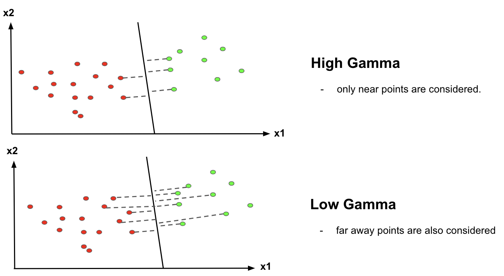

# 거리기반 이상탐지 - One Clss SVM

>## 들어가기 전에. SVM에 등장하는 개념들
<p align="center">
  
  
  <figcaption align="center">그림1. SVM 개념도</figcaption>
</p>


- SVM은 classification의 한 종류로 클래스를 잘 나누는 선(또는 평면, 또는 곡면)을 찾는 것이다.
- 위 그림은 linear svm에 대한 설명 그림이다. "linear" SVM은 class1과 2를 나누는 선 $y=wx+b$가 일차식이다. 이 일차식을 초평면(Hyperplane)이라 부른다. 클래스를 나누는 선이 곡선으로 복잡해지면 이를 kernel이라 부른다.(ex. 다항식(polynomial), Gaussian Radial, Sigmoid 등)
- Support vector: 두 클래스를 나누는 선(초평면)에 가장 가까운 데이터 점을 일컫는다.
- Margin: 두 클래스를 구분하는 거리의 폭
    - 알고리즘은 Margin을 최대화하는 방향으로 진행되며, 궁극적으로 두 클래스를 가장 동떨어지게(극명하게) 나누는 선인 초평면(hyperplane)을 찾는다.
    - 두 클래스를 나누는 선과 가장 가까운 데이터인 support vector를 얼마나 엄격하게 설정하는지에 따라 margin의 종류가 나뉜다. 파이썬 코드에서는 하이퍼파라미터 "C"에 해당한다. <br/>
        <center></center> <br/>
        <center>그림2. Hard Margin vs Soft Margin</center>
- 알고리즘(출처. [하버드 수업자료](https://harvard-iacs.github.io/2018-CS109A/lectures/lecture-20/presentation/lecture20_svm.pdf))
    - 위에서 설명한 개념을 식으로 표현하면 다음과 같다. 초평면을 찾는 방법은 앞서 언급했듯이 클래스가 다른 데이터 간 거리를 최대화하는 선을 찾는 것이다.
        <center></center> <br/>
        <center>그림3. Decision Boundary(초평면)과 support vector(경계선에 있는 데이터) 간 거리</center>

        - 여기서 거리란 [선분과 점 사이의 직선거리](https://ko.wikipedia.org/wiki/점과_직선_사이의_거리)인데 그림3에서 $\frac{-b}{|w|} = \frac{2}{|w|}$에 해당한다.

    - $x_n$의 레이블 값(정답지)은 $y_n=w^Tx+b=1$ 또는 $y_n=w^Tx+b=-1$이다.
    - 이를 종합해 식을 서술하면 아래와 같다.
        <center></center> <br/>

        - 초평면 거리 $\frac{2}{|w|}$를 최대화하되, 레이블 예측이 정답이어야 한다.
        - 데이터 포인트가 실제로 +1 레이블($y_n=1$)을 갖는데 class를 나누는 경계선 바깥에 있으면 $w^Tx+b\geq1$다. <br/> $\rightarrow$ $y_n(w^Tx+b) \geq1$
        - 데이터 포인트가 실제로 -1 레이블($y_n=1$)을 갖는데 class를 나누는 경계선 바깥에 있으면 $w^Tx+b\leq1$다. <br/> $\rightarrow$ $y_n(w^Tx+b) \geq 1$
        - 최대화 문제는 "쌍대문제"라는 표현으로 최소화 문제로 치환될 수 있다. $max_{w,b} \frac{2}{|w|} \rightarrow min_{w,b}\frac{|w|}{2}  \rightarrow min_{w,b}\frac{1}{2}|w|^2 $
        -  $y_n(w^Tx+b) \geq 1$ 라는 제한 조건이 존재할 때 해(미분을 통한 최소화의 해 찾기)를 구하려면 [라그랑주 승수](https://untitledtblog.tistory.com/96)라는 개념을 사용해야 한다.
         <center></center> 
            


> ## 정의
 <center></center> <br/>
 <center>그림3. One Class SVM 개념도</center>

- <span style="color:red"> 원점</span>으로부터 거리를 기준으로 초평면을 그어 분류(일반 SVM과의 차이), 그림3에서는 c에 해당, margin 바깥에 있는 관측치를 이상치로 판단
- SVM과 One Class SVM 비교
    ||SVM|OC SVM|
    |:---|:---|:---|
    |분류|지도학습|비지도학습|
    |알고리즘|마진을 최대화하는 초평면 찾음|원점을 기준으로 초평면 찾음|
- 손실함수: min(이상 데이터와 초평면 간 거리)


> ## 장단점
|장점|단점|
|:---|:---|
|1. label이 없어도 사용가능 <br/> 2. 적은 데이터에서 일반화에 탁월 (차원 수 수준 상관없이) <br/> 3. 데이터 특성이 적어도 성능이 좋은 편(robust, 한 번 클래스 나누는 초평면 만들어 놓으면 변경 적음)|1. 커널 기반의 방법론으로 데이터 증가에 따른 연산량이 큼 <br/> 2. Scaling에 민감 <br/> 3. 세심하게 하이퍼파라미터를 조정해야 최적 모델 탐색 가능|

- 하이퍼파라미터 종류
    - 커널 종류: linear, polynomial, radial
    - gamma: 값이 크면 초평면이 가까운 데이터를 서포트 벡터로 참조, 값이 작으면 초평면이 먼 데이터도 서포트 벡터로 참조
    - nu: 초평면 밖에 있는 이상데이터 비율(contamination과 비슷한 개념)

> ## 활용 예
- 금융 이상 거래 탐지
- 온라인 서명 - 본인 여부 탐지

> ## 코드
- [sklearn.svm.OneClassSVM](https://scikit-learn.org/stable/modules/generated/sklearn.svm.OneClassSVM.html) 공식 문서
    - kernel: ‘linear’, ‘poly’, ‘rbf’, ‘sigmoid’, ‘precomputed’ 
    <br/>디폴트는 rbf, 커널은 클래스를 나누는 초평면의 형태, 커널의 종류에 따라 계산 복잡도가 달라짐
         <center></center>  
    - gamma: ‘scale’, ‘auto’ 또는 숫자(non negative float) - [공식문서](https://scikit-learn.org/stable/auto_examples/svm/plot_rbf_parameters.html)<br/>
    감마는 개별 데이터 벡터의 영향도를 나타냄, 값이 작으면 먼 거리까지, 값이 크면 가까운 거리까지만 데이터를 참조한다.
        <center></center>  
    - nu: 훈련셋 내 이상데이터의 비율, (0, 1] 사이의 값을 가짐, 디폴트는 0.5 
```
from sklearn import svm

# 분류기 객체 생성
clf = svm.OneClassSVM(nu=0.1, kernel="rbf", gamma=0.1)

# 모델 학습 - 비지도 학습이므로 X만 필요
clf.fit(X_train)

# 이상치 예측
y_pred_outliers = clf.predict(X_outliers)
```