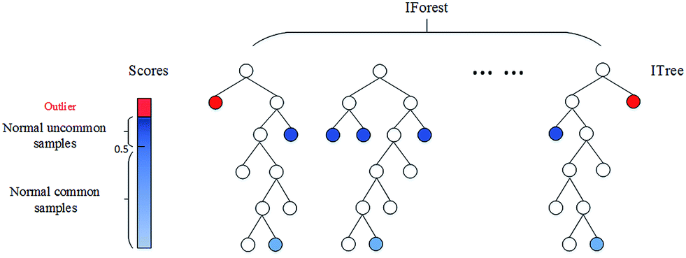

# 분류 모델 기반 이상탐지 - Isolation Forest 이상 탐지

> ## 정의
 <center></center> <br/>
 <center>그림1. Isolation Forest 이해</center>

<br>

- 랜덤포레스트와 유사하지만, 랜덤포레스트는 Supervised Learning인 반면, Isolation은 Unsupervised Anomaly Detection임
- 여러 개의 Decision Tree를 종합한 앙상블 기반의 이상탐지 기법
- 의사결정나무를 지속적으로 분기시키면서 모든 데이터 관측치의 **고립 정도** 여부에 따라 이상치를 판별하는 방법 
    * 핵심 아이디어: 이상치 데이터는 분기를 가를 때 한 번에 갈라지고, 빨리 고립된다
- **비정상 데이터는 의사결정나무 root에 가까운 단계에서 고립됨 → 핵심 원리**
- 정상 데이터는 root에서 먼 단계에서 고립
- 특정 관측치가 고립되는 leaf 노드까지의 거리를 outlier score로 정의하겠다!
- root 노드까지의 평균 거리가 짧을수록 outlier score가 높아짐 → **robust** 
  
<br>

> ## 장단점
|장점|단점|
|:-----------------|:---|
|1. 군집기반의 이상탐지 알고리즘에 비해 계산량이 매우 적음 (트리 생성시 서브샘플링) <br/> 2. Anomaly detection 성능 우수(Robust, 현업에서 자주 사용) <br/> 3. Train Data에 이상치가 포함되지 않아도 잘 동작함 (Unsupervised Learning의 특징이기도 함) <br/> 4. 트리 기반이기 때문에 데이터에 대한 가정 필요 없음|1. 분리를 위한 선을 수직과 수평으로만 자르기 때문에 잘못된 scoring이 발생할 수 있음 (대안책: extended isolation forest)|

<br>

> ## 사용방법 
> 매우 간단. 사이킷런에 있음
- from sklearn.ensemble import IsolationForest
- 데이터 현황(분포 및 특성) 파악 → 여러 클러스터가 포함된 데이터는 아닌지 확인 (잘 안 맞으므로)
- 하이퍼파라미터 결정
- 학습 및 예측
- Threshold 및 Scoring → 몇 %까지를 이상치로 정의하겠다. 현업과 계속 의사소통, 파일럿 테스트를 통해 조절해나가야함

<br>

> ## Hyper-Parameters
1. n_estimators: 나무 개수 (디폴트 100)
2. max_samples: 샘플링 데이터 개수 (정수로 적으면 그 개수만큼, 실수로 적으면 %, 아무 것도 안 적으면 전체 데이터 개수(복원추출) or 256 중 작은 수)
3. contamination: 전체 데이터에서 이상치의 비율. 이 비율에 따라 이상치로 판단하기 위한 score의 threshold를 정의
4. max_features: 학습 시 사용할 feature (디폴트 1 = 모두 사용)

<br>

> ## 활용 예
- 로그 데이터 이상탐지
- 품질관리를 위한 이상탐지 → 연산량이 적어 생산량이 많은 경우 유용하게 쓰임

<br>

> ## 코드
```python
from sklearn.ensemble import IsolationForest

# 분류기 객체 생성
clf = IsolationForest(max_samples=100, contamination=0.1, random_state=42)

# 모델 학습 - 비지도 학습이므로 X만 필요
clf.fit(X_train)

# 예측
y_pred_train = clf.predict(X_train)
y_pred_test = clf.predict(X_test)
y_pred_outliers = clf.predict(X_outliers) # -1: outlier, 1: normal

# Decision Function 확인
clf.decision_function(X_outliers) # Score 볼 수 있음. 낮을수록 outlier(음수)
clf.decision_function(X_test) # 높을수록 normal(양수), root로부터 거리가 멀다는 뜻

# 정확도
# 정확도 1) 정상 데이터셋을 얼만큼 정상으로 예측했는지?

print('테스트 데이터셋에서 정확도:', list(y_pred_test).count(1) / y_pred_test.shape[0] )

# 정확도 2) Outlier Dataset을 얼마나 Outlier로 예측했는지?

print('이상치 데이터셋에서 정확도:', list(y_pred_outliers).count(-1) / y_pred_outliers.shape[0] )

```

* Decision Function 쓰는 이유
  - -1과 1, contamination을 통해 전체 데이터를 나열했을 때 스코어링에 따라 10%를 아웃라이어로 측정하는 방법도 있지만,
  - 우리가 threshold를 다시 조정해서 우리가 만들었던 룰에 의해 이거보다 낮거나 높은 데이터에 대해 라벨링을 다시 하겠다 라고 했을 땐 decision function을 통해 재라벨링 할 수 있음 → 이 방법이 현업에서 적용할 때 조금 더 유리함
