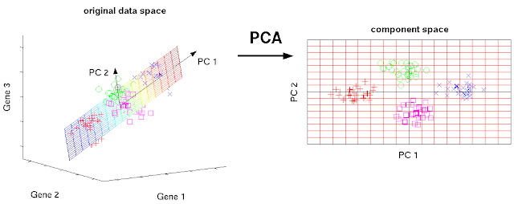
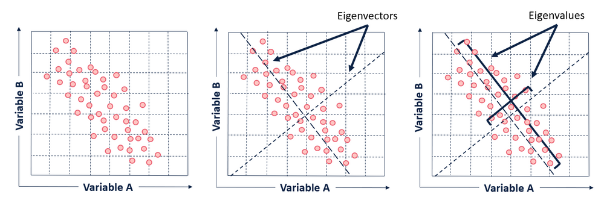
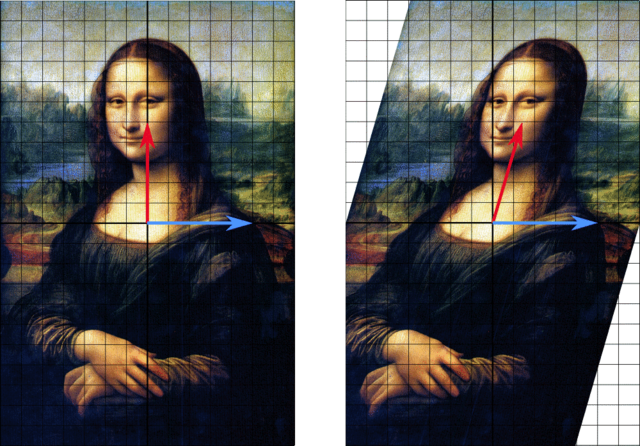

# 시각화 기반 이상탐지 - PCA를 통한 축소 차원 데이터 기반 t-SNE 시각화

- 이 장에서는 차원축소를 통해 데이터의 정보를 효과적으로 저차원에서 확인할 수 있는 두 알고리즘을 소개한다. 그런데 두 알고리즘을 시각화 용도로만 서술하기에는 수많은 알고리즘의 기초가 되는 개념을 다수 포함하고 있어 이 개념들을 짚고 넘어가고자 한다.
- PCA는 선형대수학의 핵심 개념들을 내포하며, t-sne는 정보이론의 핵심 개념을 내포한다.
    - 선형대수학에서 "변환"이라는 개념은 딥러닝에서 흔히 아핀변환으로 접해봤을 것이다. 동일한 데이터라도 변환을 통해 어떻게 표현하느냐에 따라 데이터의 특성을 더 극명하게 보여줄 수 있다. 이는 시각화 뿐 아니라, 분류 등의 알고리즘을 적용할 때 알고리즘이 헷갈리지 않고 명확한 선택을 할 수 있도록 돕는다.
    - 엔트로피의 개념은 딥러닝에서 크로스엔트로피로 많이 접해보았을 것이다. 정보이론에서의 정보는 확률이며 음수 엔트로피다. 이 확률상의 거리를 나타낸 것이 쿨백라이블러 거리다. 데이터의 물리적인 값 자체에 주목하는 것이 아니라 데이터 발생 구조(확률)에 주목하는 것이다. 
        - 모든 단어가 추상적이기 때문에 와닿지 않을 것이다. 예를 들어 설명하자면, 한국과 미국이 미식축구 대결을 한다고 하자. 미국이 이길 확률을 이진분포로 표현하자면, 이 분포는 미국이 이길 확률이 훨씬 큰 분포다. 물론 한국이 이길 확률도 존재하지만, 미국이 이길 확률이 큰 불확실성이 적은 분포다. 이러한 분포는 혼란(누가 이길지 모르는 상황)이 적기 때문에 엔트로피가 낮은 상태이며, 승부에 대한 정보가 많은 상태다. 

# 1. PCA

  

- PCA 개념도. 위 그림에서는 3차원의 데이터를 2차원 평면에 표현함으로써 클래스 별 데이터의 특성을 더 잘 보여준다.
    - 차원은 줄어들었지만 오히려 평면상에서 네 가지 클래스의 데이터가 뚜렷하게 구분된다.

> ## 들어가기전에
- 주성분분석이란 (1) 데이터를 최대한 보존하면서 (2) 차원을 축소해 정보를 보여줌으로써 해석력을 높일 수 있는 알리즘이다. 
    - 데이터를 보존한다: 현재 데이터를 다른 축에서 다르게 표현하되, 데이터의 분산을 최대한으로 유지할 수 있는 축을 찾겠다는 의미이다. 데이터의 분산은 데이터의 퍼진 정도를 의미하는 것이고 이는 곧 데이터의 다양한 패턴(variability)을 의미한다. 즉, 데이터를 새로이 보여주는 축은 데이터가 가진 다양한 현상을 가장 효과적으로 표현할 수 차원이다.
    - 분산을 최대화하는 새로운 축을 찾는 것은 다음 개념들을 내포한다.
    1. 선형변환 - [참고](https://towardsdatascience.com/principal-component-analysis-part-1-the-different-formulations-6508f63a5553)
        

  
        
주성분 축을 찾는 과정은 일종의 고유값과 고유벡터를 찾는 과정이다.
  

        - k차원의 데이터 $x=(x_1, ... , x_k)$를 어떤 벡터 $w=(w1,...w_k)$로 선형변환하면, 새로운 축 $x'=w^Tx=x_1w_1+...x_kw_k$가 된다. 그런데 이 축 위에서의 데이터의 분산 $var(w^Tx)$를 최대로 만드는 벡터 $w$가 PCA에서 찾는 선형 변환이다. $var(w^Tx)$를 최대화하려면 이 식을 $w$에 대해 미분해 미분식=0으로 찾게 된다. 그런데 이 식이 선형대수학에서의 고유값을 찾는 꼴과 동일하게 된다.  $\rightarrow Sw=\lambda w$, 여기서 $S$는 데이터 X의 공분산 행렬, $\lambda$는 스칼라(상수)
        - $w$는 고유벡터, $\lambda$는 고유값이라 부른다. 고유벡터는 방향 전환을, 고유값은 값의 스케일 조정을 의미한다. 아래 이미지를 보면, 방향만 전환하고 스케일은 그대로 둔 선형변환의 예를 보여준다.
        

  

        - PCA에서 "loadings"라는 개념이 위에서 $\lambda $(고유값)에 해당한다. 이 때 고유값을 내림차순해서 제일 큰 값의 고유값과 대응되는 고유벡터를 가장 중요한 취급을 한다. 이것은 선형대수가 아닌 PCA만의 특징인데, 데이터의 분포를 가장 크게 표현한 축을 데이터의 다양한 범주(variability)를 가장 잘 표현한 축이라고 여기기 때문이다.
    2. 직교
        - 왜 두번째 주성분 축은 첫 번째 주성분 축과 직교할까?
            - 수식적으로 설명하자면, 고유값분해는 원래 그렇다고 설명할 수 있다.
            - 정보함축에서의 의미로 해석하자면, 두번째 축이 첫번째 축과 직교할 때, 첫번째 축이 설명하는 정보와 겹치지 않으면서 데이터의 변동을 가장 넓게 표현할 수 있기 때문이다. 정보가 겹치지 않는다는 것은 correlation으로도 표현할 수 있는데, 직교하는 축 위의 점들은 correlation이 0이다. 

    

## 참고. 요인분석 vs PCA
- 도출과정이 유사하여 단골 구분 문제다.
....... 추가예정 .................

> ## 기본개념
- 변수 간 상관관계를 이용해 주성분을 추출해 차원을 축소하는 기법
- 데이터 분산을 최대화($\leftrightarrow$데이터 정보를 최대한 유지)하는 초평면을 찾고 데이터를 투영
- 오토인코더와 유사한 작동원리
- 다중공선성을 제거하기 위해 벡터의 축이 직각이 되도록 투영
- 원본 데이터의 피쳐 개수에 비해 적은 주성분으로 원본 데이터의 총 변동성을 설명

> ## 장단점
|장점|단점|
|:---|:---|
|1. 고차원 데이터를 저차원 주성분으로 표현 가능   2. 선택한 변수 해석이 용이 |1. 변수간 상관관계 표현 어려움 2. 추출된 변수의 해석이 어려움(주성분, 즉 새롭게 구성된 축이 기존 변수로 어떻게 구성된지는 알 수 있지만 축 자체를 해석하기는 어려움)|

- PCA 적용전, 데이터 정규화 필수
- 작동방식
    - 학습셋의 분산을 최대로 만드는 첫번째 축을 찾음
    - 첫번째 축과 직교하면서 분산이 그다음으로 최대인 두번째 축을 찾음
    - 첫번째, 두번째 축과 직교하면서 분산이 그다음으로 최대인 세번째 축을 찾음   
 ... 

    - 위와 같은 방법으로 피쳐 수만큼 축을 찾은 후, 정보 손실이 적은 수준의 축 개수를 선택(ex. 20개 피쳐로 찾은 축 중 3개의 PCA 축만으로 85% 정보를 유지할 수 있음 $\rightarrow$ 세 개의 축만 사용)

> ## 현업사례
- 검사 공정에서 이상 제품 탐지 - 중심점이 존재하고 방사형으로 퍼지는 데이터에 활용
- EDA 시 차원축소 후 클러스터링 가능여부 가늠

# 2. t-SNE
> ## 기본개념
- PCA는 선형 분석 방법으로 값을 투영해 차원이 감소해 데이터가 밀집 $\rightarrow$ 데이터 구별 어려움, 이 단점을 보완한 차원 축소 방법이 t-SNE
- t분포로 데이터 유사도를 계산, 분산이 큰(두꺼운 꼬리) t-분포에서는 유사도가 낮은 데이터일수록 멀리 떨어뜨림
    - 관심있는 데이터의 t분포 내 density값과 주변 데이터의 t분포 내 density값의 차이를 유사도로 간주
- 유사도가 비슷한 데이터끼리 묶어줌
- 시각화 용도로 주로 사용됨
> ## 장단점
|장점|단점|
|:---|:---|
|1. PCA 대비 고차원 데이터를 저차원 데이터로 클러스터링하는 데 유리  2. 사용이 쉬움  3. 비선형 데이터 군집 가능|1. 데이터가 많을수록 연산량 증가 2. 실행마다 다른 시각화 결과|

> ## 현업사례
- 검사 공정에서 이상 제품 탐지 
- EDA 시 차원축소 후 클러스터링 가능여부 가늠